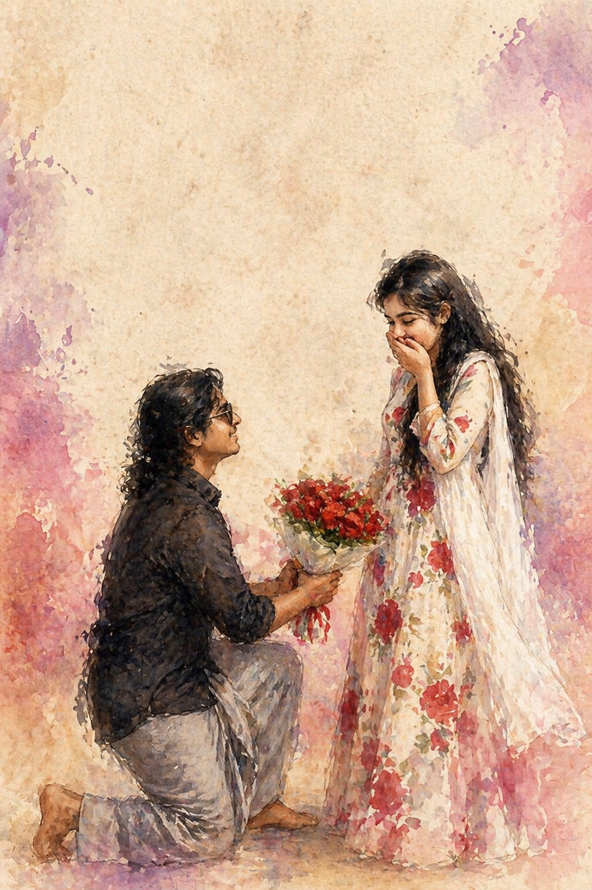

<html>
<head>
<meta charset="UTF-8">
<meta name="viewport" content="width=device-width, initial-scale=1.0">
<title>For chlw ❤️</title>

</head>

<body>

<h1>🫀chellameyy🤌🏻🥹</h1>

<h2>📸 Our Memories 📸</h2>

<h2>💌 A Message From Hari 💌</h2>

  Hyy Chellam ❤️,

Nee en life-la kedaicha azhagana gift. Unna ennaikkum izhakka naan virumbala 🥺🤌🏻. Sila per namma life-la varuvaanga, sila per poguvaanga. Aana sila per mattum namma manasula veedu katti nirantharama iruppaanga. Enakku appadi irukkura oruththi nee dhaan ❤️.

Ithu vara en life-la ethanaiyo peru vandhirukanga. Aana yaarumey unna maari enakku oru feel kudukkala. Yaarumey enna ippadi maathala, purinjukkala, sirikka vechadhum illa. Including en ex kooda 😂. Un kitta dhaan naan enna naana irukka mudiyudhu.

"Love is not about finding a perfect person, it's about seeing an imperfect person perfectly." ❤️

Nee eppovum solluva, "Unnaku enna vida unga family dhaan mukkiyam" nu. Aana ipo naan solluren... en life-la mukkiyamaana vanga list eduthaa, adhul nee eppovum special place-la dhaan iruppa. 1000 times choose panna sonnalum, naan unnai dhaan choose pannuven ❤️.

Naan thappu panna en mela kovappadu, sanda podu, kaththu, enna thittu... aana vittutu mattum poidatha. Ennaala adha thaanga mudiyadhu. Sila per pirinjittu ponaal kashtam varum, aana nee pirinjittu pona en ulagam-e odanjidum 💔.

"Some people are worth never giving up on." ❤️

Ithu vara naan unna kashtapaduthi irundha, azha vechi irundha, hurt panni irundha... adhukku ellathukkum manasara sorry ammu 😭. Naan perfect illa, aana unna santhoshama veikka try panna poravan naan. Ini naan enna maathikka try panren, better person aaga try panren, unakku pidicha Hari-a irukka try panren ❤️.

Nee enna paaka eppo varuva di? Unna paathu pesanum, sirikanum, sanda podanum, marubadi serndhu sirikanum nu aasaiya irukku 🥺.

Nee enna miss panriya nu enakku theriyala... aana naan unna romba miss panren 😭❤️. Sila neram phone screen-a paathu ukkanthu, nee message anuppuviya nu wait pannitu iruppen.

"Distance means so little when someone means so much." ❤️

Un sirippu enakku pidikkum.
Un kovam enakku pidikkum.
Un voice enakku pidikkum.
Un presence enakku pidikkum.
Nee mattum enakku romba romba pidikkum ❤️🥺.

Love you di ❤️.

Indha surprise unakku pudikkum nu nenaikiren. Pudichirundha oru message anuppu, illa oru call pannu 😁. Un reaction paaka naan wait pannitu iruppen.

Kadaisiya oru vishayam...

Nee vandhadhukku munnaadiyum naan vaazhndhen.
Aana nee vandha apram dhaan vaazhkai azhaga irukkunu purinjadhu ❤️🌹.

Forever Yours,
Hari ❤️

<h2>❤️ A Small Message ❤️</h2>

No song can express how special you are to me.
Every moment with you is my favorite melody. ❤️

## 🎵 Our Song 🎵

[🎵 Kannana Kanne 🎵](https://youtu.be/B_BYxNsjF08?si=EzV-FdUr0Y954B0E)

</body>
</html>
